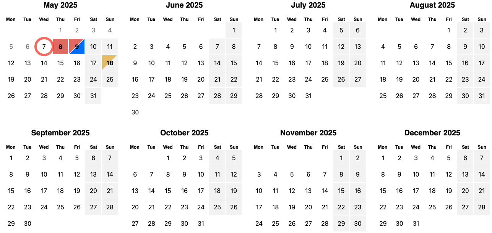

# HeimV Calendar

An occupancy calendar used by HeimV project.



## Features

- Full an halfday occupancies 
- Custom occupancy popovers
- Date range selection
- Different view modes
- Many customization options

## Install

```bash
npm install heimv-calendar
yarn add heimv-calendar
pnpm install heimv-calendar
```

## Usage

### Basic usage

```tsx
import { Calendar } from "heimv-calendar";
import "heimv-calendar/index.css";

<Calendar />
```

### Occupancies

#### `Occupancy<O>`

| Property | Type      | Description                                                                                           |
| :------- | :-------- | :---------------------------------------------------------------------------------------------------- |
| key      | `string`  | Unique key to identify the occupancy                                                                  |
| color    | `string?` | The color in which the occupancy should be displayed                                                  |
| amount   | `number?` | Little number in the corner of the occupancy indicating how many occupancies are booked to this slot. |
| data     | `O?`      | Optional generic data to pass to the occupancy, which will be retrieved in callbacks.                 |

#### `OccupancySlot<O>`

| Property  | Type            | Description                           |
| :-------- | :-------------- | :------------------------------------ |
| allDay    | `Occupancy<O>?` | Represents occupancy for the full day |
| forenoon  | `Occupancy<O>?` | Represents occupancy in the morning   |
| afternoon | `Occupancy<O>?` | Represents occupancy in the afternoon |

#### Example

```tsx
const occupancies: Map<string, OccupancySlot<{ additionalData: string }>> = new Map([
	["2025-05-08", { allDay: { key: "0196a9b9-0435-712b-b5b2-c1892dcdaabe", color: "#e85f5f" } }],
	[
		"2025-05-09",
		{
			forenoon: { key: "55441c4b-1e68-4f9b-9141-5658f14d411c", color: "#e85f5f" },
			afternoon: { key: "9060b84c-c09a-44de-8ad7-d0d908d1d5ea", color: "#0061ff" },
		},
	],
	[
		"2025-05-18",
		{
			forenoon: {
				key: "55441c4b-1e68-4f9b-9141-5658f14d411c",
				color: "#e8bc56",
				data: { additionalData: "Some data" },
			},
		},
	],
]);

// ...

<Calendar occupancyOfDate={(date: Date) => occupancies.get(date.toISOString())} />
```

### Configuration

#### Calendar Props

| Property               | Type                                     | Description                                                            | Default      |
| ---------------------- | ---------------------------------------- | ---------------------------------------------------------------------- | ------------ |
| firstDate              | `Date`                                   | The date from where the calendar begins                                | current date |
| mode                   | `"view"` \| `"interactive"` \| `"range"` | Represents the calendar's mode                                         | `"view"`     |
| viewMode               | `"months"` \| `"year"`                   | The current visual display mode of the calendar                        | `"months"`   |
| visibleMonth           | `number`                                 | Defines how many months should be displayed (only for `"months"` view) | `8`          |
| defaultColor           | `string`                                 | The default color for occupancies                                      | `#e85f5f`    |
| highlightWeekends      | `boolean`                                | Defines wether to visually highlight the dates on the weekends         | `true`       |
| occupancyOfDate        | `(Date) => OccupancySlot \| undefined`   | A function that returns the occupancy slot of a date            | —            |
| disableDate            | `(date: Date) => boolean`                | Function to determine if a date should be disabled                     | —            |
| renderOccupancyPopover | `(occupancy: Occupancy<O>) => ReactNode` | Render function for the occupancy popover                              | —            |

#### Mode `interactive`

The `interactive` mode allows the user to interact with the calendar by clicking on dates and occupancies.

It adds the following Properties to `Calendar` component:

| Property         | Type                                | Description                                                                                                |
| ---------------- | ----------------------------------- | ---------------------------------------------------------------------------------------------------------- |
| onOccupancyClick | `(occupancy: Occupancy<O>) => void` | Callback when an occupancy is clicked                                                                      |
| onDateClick      | `(date: Date) => void`              | Callback when a date is clicked                                                                            |
| getDateHref      | `(date: Date) => string`            | Function to resolve a href based on the given date. When applied all dates will be turned into `<a>` Tags. |

#### Mode `range`

The `range` mode allows the user the select date range inside the calendar.

It adds the following Properties to `Calendar` component:

| Property      | Type                         | Description                                                             |
| ------------- | ---------------------------- | ----------------------------------------------------------------------- |
| onSelectRange | `(range: DateRange) => void` | Callback triggered when eather start or end date of a range is selected |
| selectedRange | `DateRange`                  | The currently selected date range                                       |

##### Example

```tsx 
const [selectedRange, setSelectedRange] = useState<DateRange>([new Date(), undefined]);

<Calendar mode="range" selectedRange={selectedRange} onSelectRange={setSelectedRange} />
```

### Theming

The component can be color themed by overwriting a few css variables.

This is the default config:

```css
:root {
	--calendar-occupancy-color: #e85f5f;
	--calendar-date-selected-color: #30388e;
	--calendar-date-hovered-color: rgb(from var(--calendar-date-selected-color) r g b / 70%);
}
```

> Note: if you want to change the default occupancy color per calendar, there is a `defaultColor` prop on the component.
